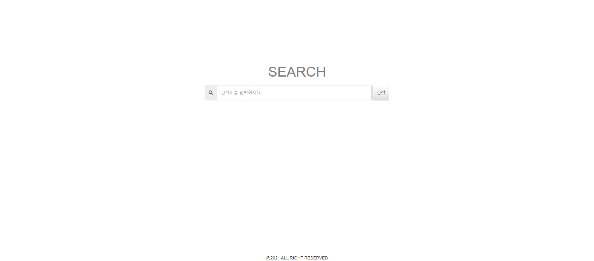
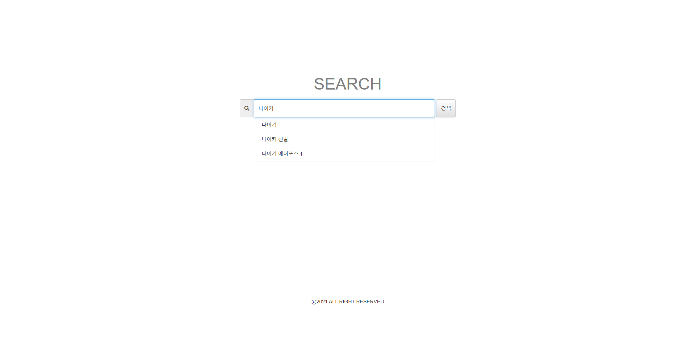

# project-search | 검색어 추천 서비스

검색어 추천 서비스의 사용 예제입니다.

## 사용 예제
- <a href="#home-page">홈 페이지</a>
- <a href="#recommended-keyword">추천 검색어</a>
- <a href="#search">검색</a>
- <a href="#new-keyword">새로운 키워드</a>

### 홈 페이지
최초 접속 시 홈 페이지입니다.  

  

 
 

### 추천 검색어
검색 키워드 입력 시 입력된 키워드에 따라 추천 검색어를 제공합니다.  

  

3 개의 데이터(나이키, 나이키 신발, 나이키 에어포스 1)가 삽입된 상태입니다.  
가장 유사한 키워드 순서로 추천 검색어를 확인할 수 있습니다.  
 
 

### 검색
다음은 검색 과정입니다.  

  

추천 키워드 클릭 시, 즉시 해당 키워드로 검색합니다.  

상단의 바에서 검색한 키워드에 대한 추천 키워드를 확인할 수 있습니다.  
 
 

### 새로운 키워드
새로운 키워드(나이키 바람막이) 입력에 대한 과정입니다.  

  

새로운 키워드 최초 검색 시 해당 키워드에 대한 추천 키워드를 제공하거나 추천 키워드에 노출되지 않습니다.  
일정 주기로 실행되는 추천 알고리즘을 통해 데이터 가공 이후 추천 키워드로 제공되거나 추천 키워드에 노출됩니다.  
